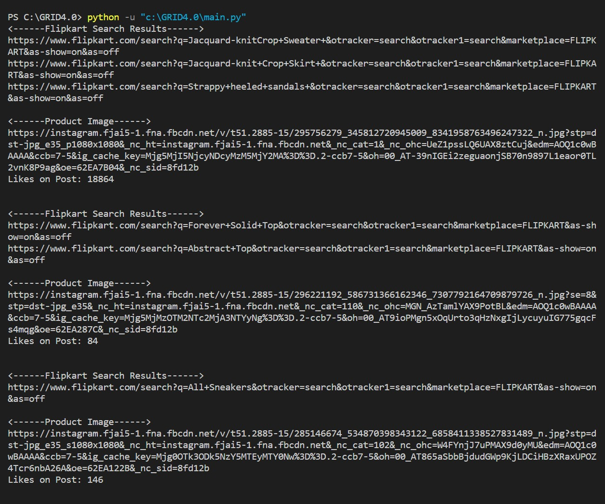

  <h1 align="center">Trend Extraction</h1> 

---

## Introduction

As part of this challenge, we identified trends from social media data and from all the
products available on Flipkart we identified trending products. 
Output: Flipkart Links and its corresponding Post on Social Media with likes. 

---

 
 

## Requirements

To install Instaloader, 
Ensure that you have Python, at least version 3.6, and pip installed. 
Then, install Instaloader using: 
pip3 install instaloader 
To upgrade Instaloader to its current version, do: 
pip3 install --upgrade instaloader 

---

 
 

## Sample Images

<h3>Links Generated</h3>

 
 

## Development

# Run 
python3 main.py
